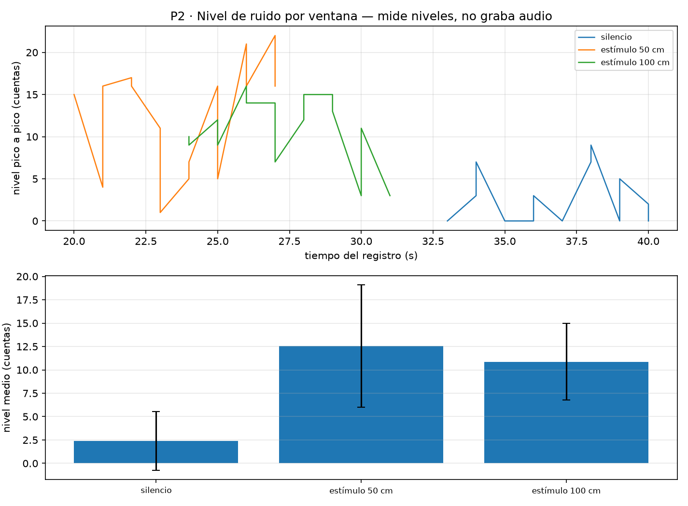

# P2 — Monitor de calidad de aire y ruido del campus

## E02 — Daniel Quintero
**Simulación Wokwi:** [E 02-GT1](https://wokwi.com/projects/472438716081998849)

### Integrantes
**Dylan Arias — Pablo Lazo — Lucas Maldonado — Sergio Mella — Gabriel Castro**

## 1. Lazo de Muestreo
> Se implementó un muestro que no bloquea utilizando milis(). Para la simulación se modeló el comportamiento del sensor de ruido (Ky-308), configurando PERIODO_MS= 5000.
> Justificación: Según nuestro plan, pueden haber picks de sonido (golpes, gritos, etc), que al muestrear en un intervalo pequeño de periodo de tiempo podemos captar estos sin perder data.

## 2. Calibración y Tolerancia
> Para corregir el error sistemático del sensor imperfecto, se obtuvieron 2 lecturas crudas y aplicamos la formula de corrección.
> 
> **Referencia (R) — Lectura medida (M)**  
>   R1 = 7 — M1 = 9.38  
>   R2 = 33 — M2 = 36.66  
>   **R3 = 19 — M3 = 21.97 (medido) , 19.02 (calibrado) , 18.98 (filtrado)**
>
> **Datos calculados y aplicados en el código**
> - Ganancia (m) = 0.953  
>   $m = \frac{R_2 - R_1}{M_2 - M_1}$
> 
> - Offset (b) = -1.939  
>   $b = R_1 - (m \times M_1)$
>
> Con esto pudimos verificar que tras inyectar los valores m y b calculados, al ingresar un nuevo punto (R3 = 19) se obtuvieron valores esperados con una tolerancia de ± 0.05 respecto al valor inicial.

## 3. Filtro y Ruido
> Se activo simulación de ruido sobre la lectura ADC. Para mitigar esta inestabilidad, se implemento un filtro de media móvil.
>
> **PARAMETROS: N_FILTRO=5**
>
> **JUSTIFICACIÓN**: Combinado con nuestros 5 segundos de muestreo, un N=5 no da una inercia de 25 segundos. Al hacer esto, picks que se podrían dar como un grito, etc, se verían eliminados, pero aumentos que regulares, como simplemente más gente conversando, no un incremento situacional sino uno estable se ve reflejado, eliminando estos datos atípicos.
> 

## 4. Verificación física del sensor KY-038 (Familia A — GT2 Ítem 1)

### Declaración de Privacidad
> **Privacidad:** Este nodo mide exclusivamente niveles de amplitud por ventana (cuentas pico a pico). No graba, no almacena ni transmite audio ni conversaciones en ningún momento, conservando solo un valor escalar representativo por cada intervalo.

### Protocolo y Condiciones del Ensayo
* **Pin de lectura:** GPIO 32 (ADC1 del ESP32 con atenuación de 11 dB).
* **Ventana de integración:** 50 ms (muestreo continuo sin retardos, informe cada 500 ms).
* **Orientación del micrófono:** Frontal directo hacia la fuente sonora.
* **Estímulo sonoro:** Tono continuo puro generado por teléfono con frecuencia y volumen constantes.

### Resultados Obtenidos (Amplitud Pico a Pico)

| Condición | Muestras | Media (cuentas) | Dispersión ($\sigma$) | Rango (mín-máx) | Separación sobre reposo |
| :--- | :---: | :---: | :---: | :---: | :---: |
| **Silencio (Reposo)** | 15 | 2 | 3.2 | 0 – 9 | — |
| **Estímulo a 50 cm** | 15 | 13 | 6.5 | 1 – 22 | +10 cuentas ($3.2\times\sigma$) |
| **Estímulo a 100 cm** | 15 | 11 | 4.1 | 3 – 16 | +8 cuentas ($2.7\times\sigma$) |



### Criterio de Verificación y Parámetros para GT3
* **Criterio de éxito:** El estímulo a 50 cm supera en **$3.2$ veces la dispersión de reposo** del recinto, cumpliendo con la separación mínima exigida para discriminar eventos sonoros sobre el ruido ambiente[cite: 1, 4].
* **Unidades:** Los datos se reportan estrictamente en **cuentas pico a pico ($V_{pp}$)** y no en decibeles ($dB$), dado que no se contó con un sonómetro patrón calibrado en mesa[cite: 1, 4].
* **Constante propuesta para el firmware (GT3):**
  ```cpp
  const int UMBRAL_RUIDO_PP = 18; // Reposo (2) + 5 * dispersión (3.2)
